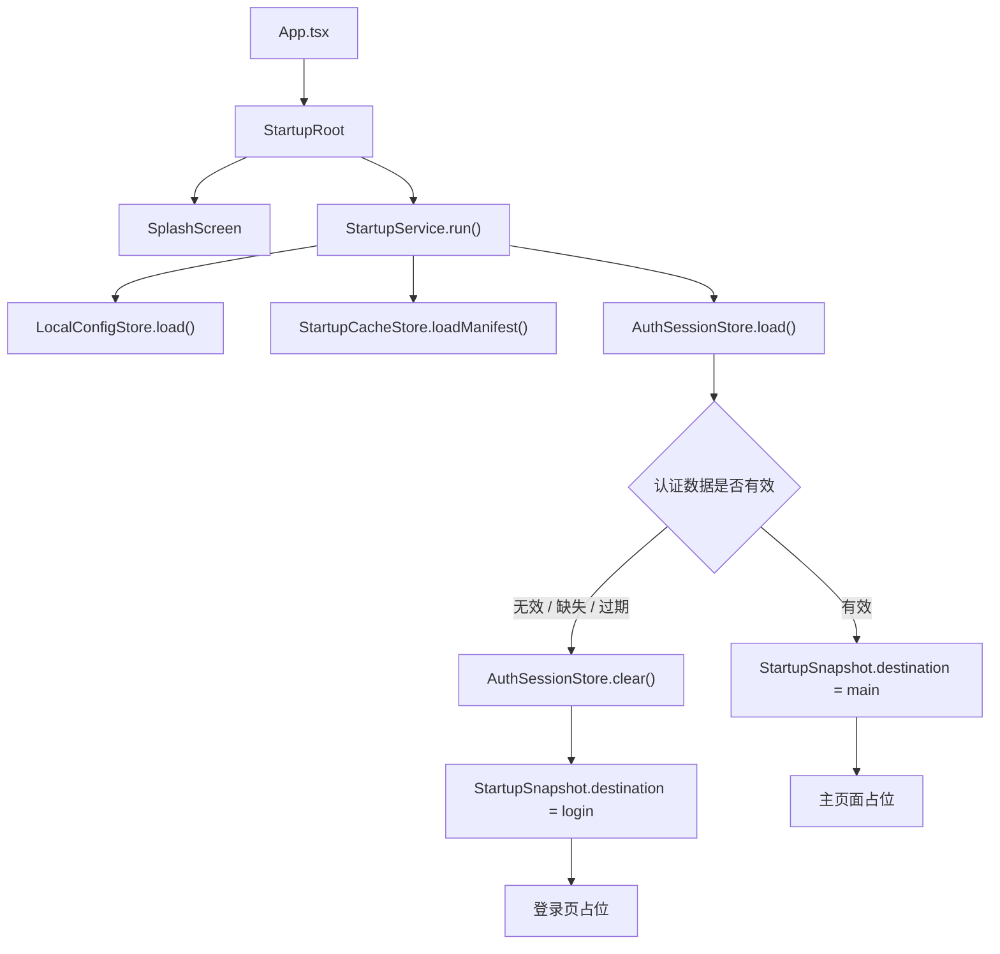

# Flash IM 启动模块设计

> 版本：v1  
> 日期：2026-06-21  
> 范围：正式 Flash IM App 启动流程，不包含 playground。

## 1. 背景

当前正式入口 `App.tsx` 直接渲染 `src/screens/HomeScreen.tsx`，页面显示“环境已就绪”。随着项目从 playground 进入 Flash IM App 创作阶段，需要一个真实的启动模块承接应用冷启动流程：

- 展示品牌启动页：logo + `Flash IM`。
- 读取本地配置。
- 读取本地缓存资源元信息。
- 读取认证数据。
- 根据认证状态进入登录页或主页面。

启动模块要保持层次分明，不能把读取缓存、判断登录、展示 UI 都塞进一个组件里。

## 2. 目标

1. 建立正式 App 的启动编排入口。
2. 启动页视觉上只承担品牌露出：logo + `Flash IM`。
3. 初始化逻辑由 service 层负责，UI 只消费状态。
4. 本地数据读取通过 storage 抽象完成，后续可替换为 AsyncStorage、Keychain、MMKV 等真实实现。
5. 登录页和主页面先使用文字空白页占位，为后续真实模块留出口。
6. 保持生产入口和 playground 入口隔离。

## 3. 非目标

- 不实现真实登录表单。
- 不实现真实 IM 主页面。
- 不连接远程 profile 校验接口。
- 不实现复杂动画。
- 不处理多账号、设备会话、刷新 token。

## 4. 用户体验

启动时先展示 Splash 页面：

```text
[ logo ]

Flash IM
```

建议视觉风格：

- 背景沿用当前正式入口深色基调：`#050510`。
- logo 居中，宽高约 88px。
- `Flash IM` 位于 logo 下方，字重高，文字简洁。
- 不展示调试文本、接口地址、加载清单。
- 最短展示时间建议 800ms，避免启动页一闪而过。

初始化完成后：

- 有可用认证数据：进入主页面空白占位。
- 没有认证数据、认证数据损坏或过期：进入登录页空白占位。

## 5. 模块结构

```text
client/flash_im/src/features/startup
├── StartupRoot.tsx
├── index.ts
├── model
│   └── StartupTypes.ts
├── service
│   └── StartupService.ts
├── storage
│   ├── StartupStorage.ts
│   └── createDefaultStartupStorage.ts
└── view
    ├── SplashScreen.tsx
    └── StartupPlaceholderScreen.tsx
```

### 5.1 `StartupRoot.tsx`

正式启动模块的容器组件。

职责：

- 创建默认 storage。
- 创建 `StartupService`。
- 在组件挂载后执行启动流程。
- 管理 `loading / ready / error` 状态。
- 根据 `StartupDestination` 渲染启动页、登录占位页或主页面占位页。

不负责：

- 直接读取本地存储。
- 解析 token。
- 实现具体登录/主页面业务。

### 5.2 `model/StartupTypes.ts`

保存启动模块实体和状态类型。

核心类型：

```ts
export type StartupPhase = 'loading' | 'ready' | 'error';

export type StartupDestination = 'login' | 'main';

export type AppLocalConfig = {
  apiBaseURL: string;
  environment: 'development' | 'production';
};

export type CachedAuthSession = {
  accountId: string;
  expiresAt: number;
  token: string;
  userId: string;
};

export type CachedResourceManifest = {
  avatarCacheVersion?: string;
  lastSyncedAt?: number;
};

export type StartupSnapshot = {
  authSession: CachedAuthSession | null;
  config: AppLocalConfig;
  destination: StartupDestination;
  resourceManifest: CachedResourceManifest;
};
```

### 5.3 `storage/StartupStorage.ts`

定义本地数据读取接口。

```ts
export type LocalConfigStore = {
  load: () => Promise<AppLocalConfig>;
};

export type AuthSessionStore = {
  clear: () => Promise<void>;
  load: () => Promise<CachedAuthSession | null>;
};

export type StartupCacheStore = {
  loadManifest: () => Promise<CachedResourceManifest>;
};
```

第一版可以提供轻量默认实现：

- `LocalConfigStore`：返回默认配置。
- `StartupCacheStore`：返回空缓存元信息。
- `AuthSessionStore`：先从抽象接口读取，测试中可注入假数据。

后续接入真实持久化时：

- 本地配置和缓存元信息可使用 AsyncStorage 或 MMKV。
- token 更适合 Keychain / Keystore；学习阶段如先用 AsyncStorage，需要在代码中明确隔离在 `AuthSessionStore` 实现里，方便后续替换。

### 5.4 `service/StartupService.ts`

启动编排服务，脱离 UI 可独立测试。

职责：

1. 并行读取本地配置、缓存资源元信息、认证数据。
2. 判断认证数据是否可用。
3. 返回 `StartupSnapshot`。
4. 对本地读取异常做降级处理。

认证判断规则：

- `authSession === null`：进入登录页。
- `token` 为空：清理认证数据，进入登录页。
- `expiresAt <= Date.now()`：清理认证数据，进入登录页。
- 认证数据有效：进入主页面。

异常策略：

- 配置读取失败：使用默认配置继续。
- 缓存元信息读取失败：使用空缓存继续。
- 认证读取失败：清理认证数据，进入登录页。
- 启动流程不做远程网络请求，避免弱网卡住启动。

## 6. 数据流



## 7. App 集成

正式入口改造为：

```tsx
function App() {
  return (
    <SafeAreaProvider>
      <StatusBar barStyle="light-content" backgroundColor="#050510" />
      <StartupRoot />
    </SafeAreaProvider>
  );
}
```

`index.playground.js` 保持不变，继续注册 `PlaygroundApp`。

## 8. Logo 接入

用户后续提供 logo 后，建议放在：

```text
client/flash_im/src/features/startup/assets/flash_im_logo.png
```

`SplashScreen` 使用：

```tsx
<Image source={flashIMLogo} />
```

如果 logo 暂未提供，实现阶段可以先保留 `logoSource` prop，测试使用假 source，避免 UI 和资源准备互相阻塞。

## 9. 测试策略

### 9.1 Service 测试

覆盖：

- 无认证数据时进入登录页。
- 有未过期 token 时进入主页面。
- token 过期时清理认证数据并进入登录页。
- 配置读取失败时使用默认配置。
- 缓存读取失败时使用空缓存。
- 认证读取失败时进入登录页。

### 9.2 View 测试

覆盖：

- Splash 展示 `Flash IM`。
- Splash 预留 logo 容器或渲染 logo。
- 登录占位页展示“登录页”。
- 主页面占位页展示“主页面”。

### 9.3 App 边界测试

覆盖：

- 正式入口渲染启动模块。
- 正式入口不引入 playground。
- playground 入口仍独立。

## 10. 后续演进

1. 接入真实登录页。
2. 接入真实主页面。
3. 使用安全存储保存 token。
4. 增加远程 profile 静默校验。
5. 增加启动阶段性能埋点。
6. 增加启动失败兜底页和重试入口。
